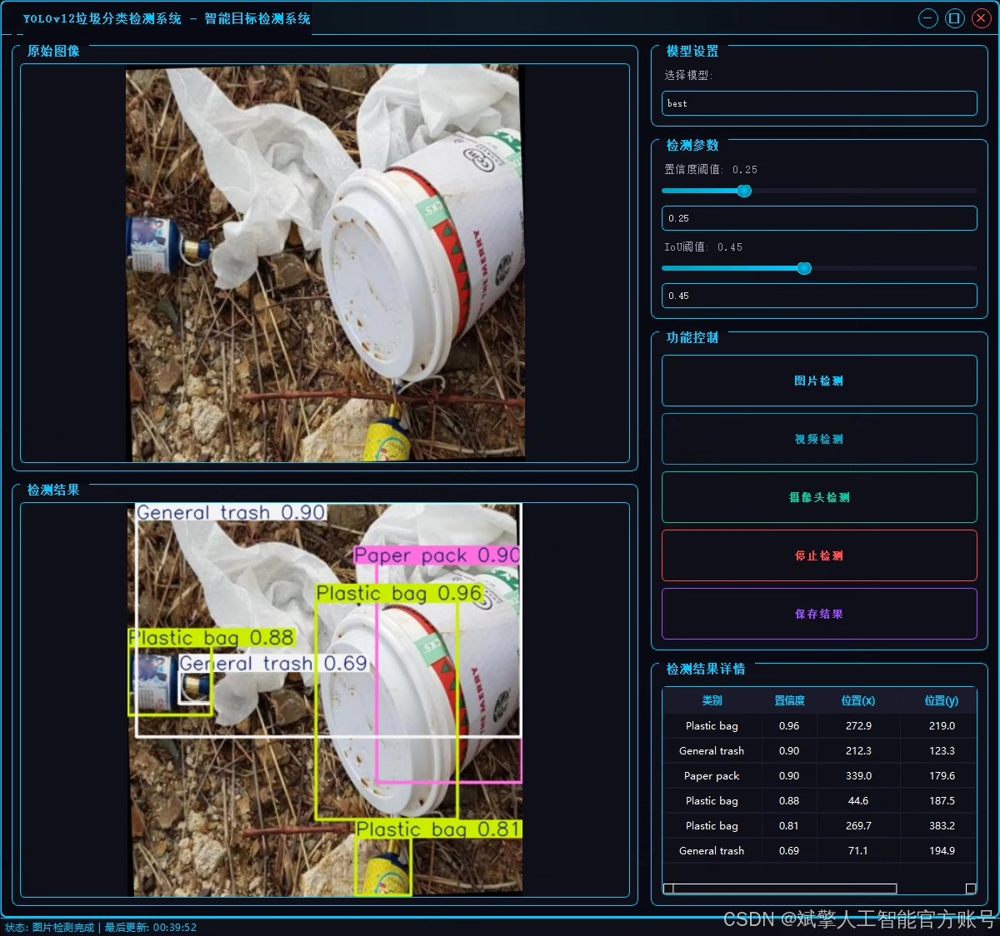
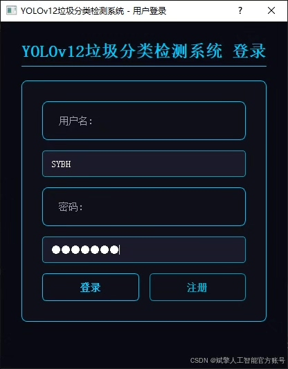
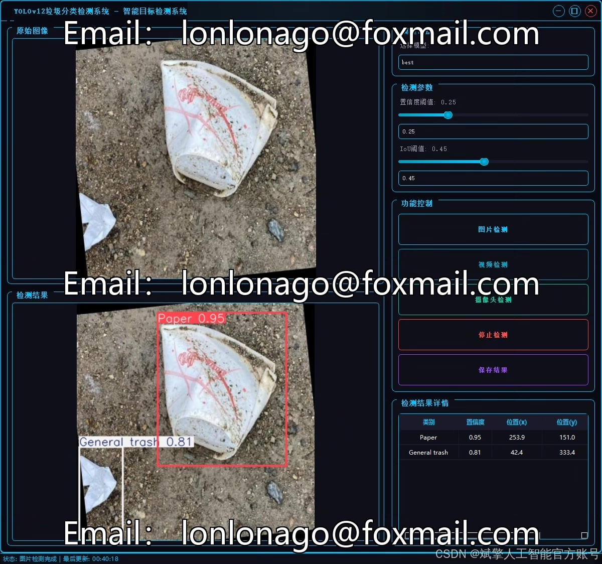
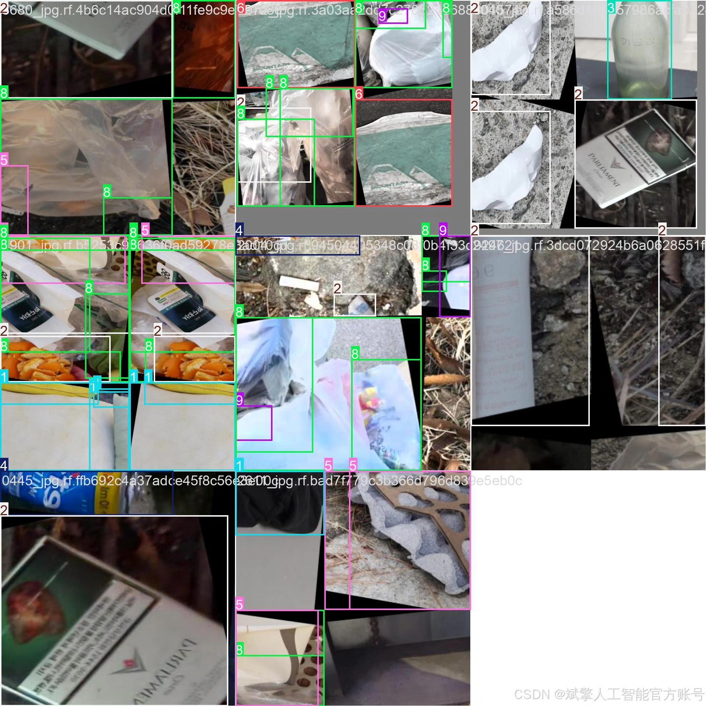
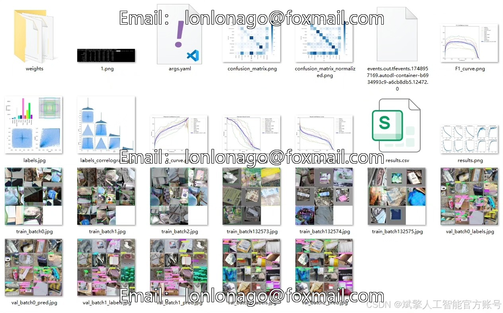
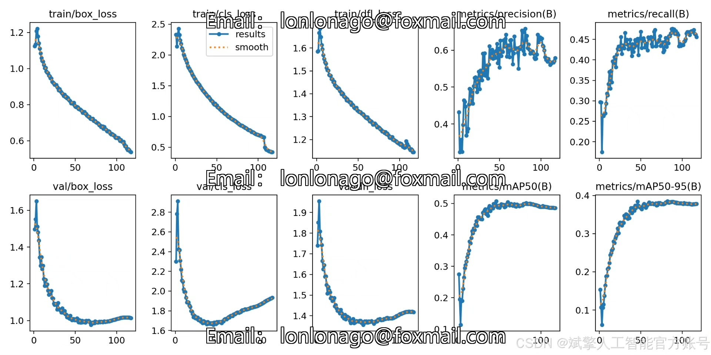
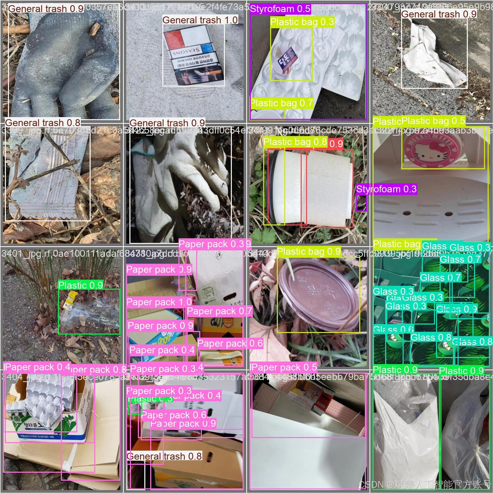

# YOLOv12 Classification System for Waste Sorting

## Body

YOLOv12 Classification System for Garbage Sorting Based on Deep Learning YOLOv12

This paper proposes a garbage intelligent classification system based on the deep learning target detection model YOLOv12, aiming to achieve efficient and accurate garbage recognition and classification. The system is designed to detect 10 common types of garbage (including batteries, clothes, glass, metal, plastic, etc.) using a self-built YOLO format dataset, which includes training set (9909 images), validation set (977 images), and test set (486 images). Through the YOLOv12 model structure, the system integrates a user-friendly UI interface, supporting login and registration functions, facilitating user interaction and data management. Experimental results show that this system outperforms traditional methods in terms of real-time performance and accuracy, providing a feasible solution for intelligent application in garbage sorting.

✅ User Login and Registration: Supports password verification and security authentication.
✅ Three Detection Modes: Based on the YOLOv12 model, supports image, video, and real-time camera detection, accurately recognizing targets.
✅ Dual-Screen Contrast: Displays the original scene and detection results on the same screen.
✅ Data Visualization: Real-time table displaying the category, confidence, and coordinates of detected targets.
✅ Intelligent Parameter Tuning: Offers a confidence slide bar to dynamically optimize detection accuracy, adapting to different scene needs.
✅ Sci-Fi Style Interaction Interface: Dark theme combined with dynamic light effects, reducing visual fatigue and enhancing operational experience.

## Images

## Payment

Here is a pay link on Stripe ( https://buy.stripe.com/3cs8yP7sY87d0vu9AB ). Please contact me lonlonago@foxmail.com after funding $89, and I will send you a complete data files , thank you!

